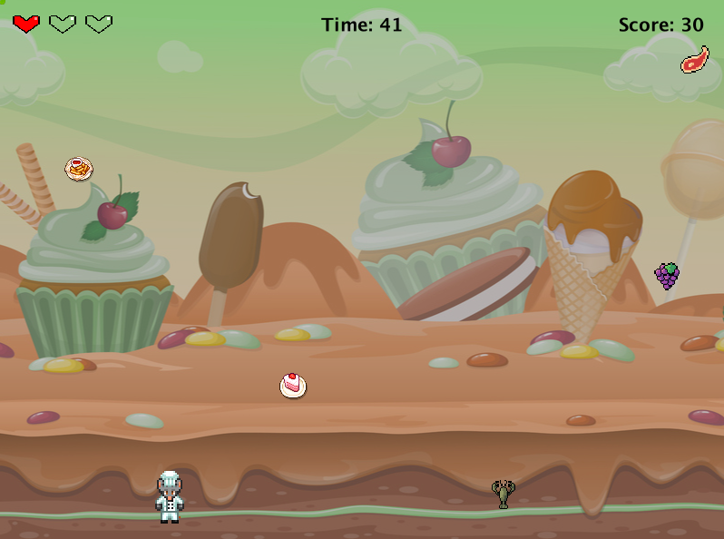
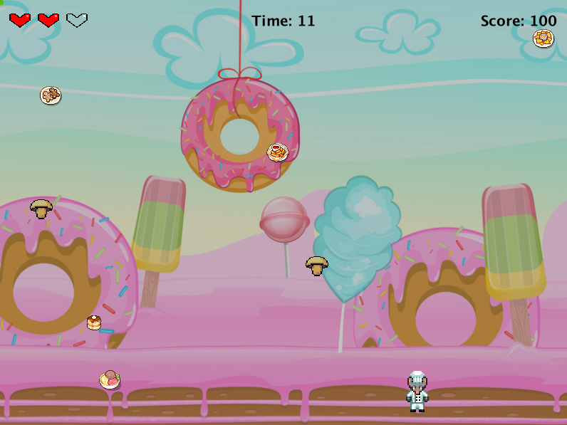

# HealthyFoodFeast-greenfoot-minigame 🎮🥦
A fun and fast-paced arcade game built with Greenfoot where you must eat healthy and dodge junk!

Made with Java & Greenfoot.
## About the game
Healthy Food Feast is an arcade-style mini-game created with Greenfoot.  
Control Chef Fresh, catch fruits and vegetables to earn points, and avoid junk food that costs you lives!  
Level up when you reach 100 points and race against the timer to reach 250 points and win!

## Gameplay instructions
- Move LEFT and RIGHT using the arrow keys.
- Catch healthy food (+10 points at Level 1, +20 points at Level 2).
- Avoid unhealthy food (lose one life).
- Catch heart bonuses to regain lives.
- You start with 3 lives.
- You have 60 seconds to score as many points as possible.
- Reach 100 points to unlock Level 2 (faster falling speed, more junk food).
- Reach 250 points before time runs out to win!

